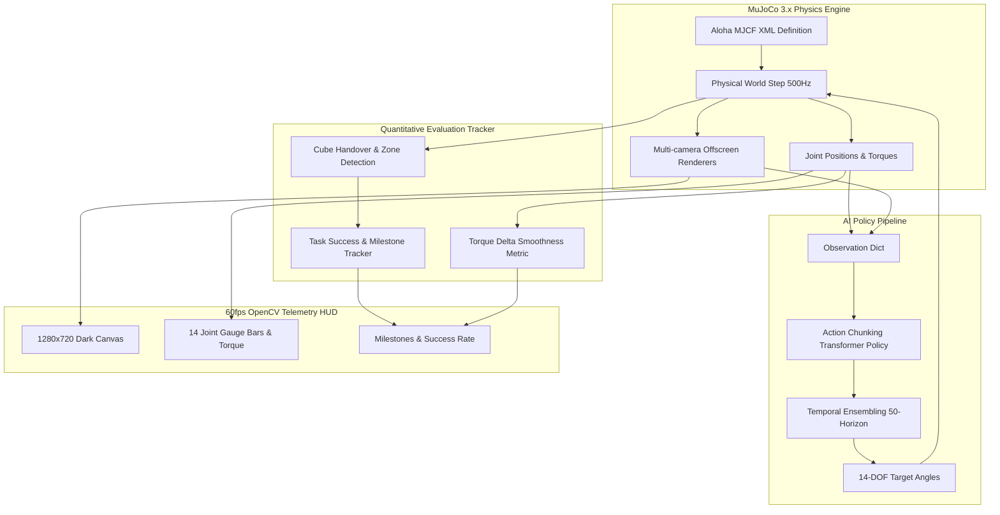

# System Architecture - Aloha 14-DOF LeRobot Simulation

## Module Responsibility
1. `aloha_env.py`: Encapsulates MuJoCo XML, kinematics, contacts, and multi-camera views.
2. `policy_runner.py`: Implements ACT Action Chunking and Temporal Ensembling.
3. `metrics_tracker.py`: Computes research-grade metrics (Success, Time, Jerk).
4. `telemetry_hud.py`: Delivers 60fps real-time visualization with zero memory leak.
5. `run_aloha_sim.py`: Manages the overall execution loop and CLI options.
