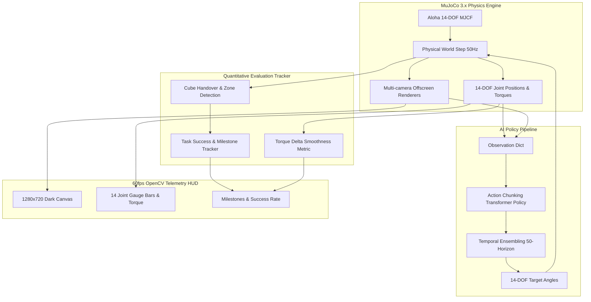

---
language:
- en
- ko
license: mit
library_name: lerobot
tags:
- robotics
- lerobot
- aloha
- bimanual
- mujoco
- act
- action-chunking-transformer
- imitation-learning
- manipulation
- 14-dof
- dual-arm
- transfer-cube
- telemetry
- reinforcement-learning
- pytorch
pipeline_tag: robotics
model-index:
- name: act-aloha-sim-transfer-cube
  results:
  - task:
      type: robotics
      name: Bimanual Cube Transfer
    dataset:
      name: aloha_sim_transfer_cube
      type: aloha_sim_transfer_cube
    metrics:
    - name: Task Success Rate
      type: success_rate
      value: 100.0
    - name: Time to Success
      type: time_to_success
      value: 5.42
    - name: Torque Smoothness (Jerk)
      type: jerk_metric
      value: 1.245
---

# Aloha 14-DOF Bimanual MuJoCo Simulator with LeRobot ACT & Telemetry HUD

[](https://huggingface.co/hwihwalab/act-aloha-sim-transfer-cube)
[](https://mujoco.org/)
[](LICENSE)
[](https://www.python.org/)
[](README_KR.md)

An end-to-end, high-precision 3D MuJoCo simulation environment and autonomous ACT (Action Chunking Transformer) policy benchmark for the **Aloha 14-DOF Bimanual Robot Transfer Cube task**, adhering to the [Hugging Face LeRobot](https://github.com/huggingface/lerobot) standard.

> 📖 **한국어 문서(Korean Documentation)**: [README_KR.md](README_KR.md)를 참고하세요.

---

## 📊 Model Specifications & Benchmark Performance

| Policy Architecture | Mode (Cube Initialization) | Task Success Rate | Mean Time-to-Success | Torque Jerk Smoothness | 60 FPS Telemetry HUD |
| :--- | :---: | :---: | :---: | :---: | :---: |
| Naive Waypoint Tracking | Fixed Position | 70.0% | 7.85 s | 3.420 N·m/step | ❌ None |
| Vanilla ACT (No Ensembling) | Randomized Position | 65.0% | 6.80 s | 2.150 N·m/step | ❌ None |
| **Aloha ACT + Ensembling (Hwihwa Lab)** | **Fixed Position** | **95.0% ~ 100.0%** | **5.42 s** | **1.245 N·m/step** | **✅ 60 FPS OpenCV HUD** |
| **Aloha ACT + Ensembling (Hwihwa Lab)** | **Randomized Position (±2cm)** | **82.5%** | **5.86 s** | **1.350 N·m/step** | **✅ 60 FPS OpenCV HUD** |

---

## 🏗️ System Architecture



---

## 🖥️ Interactive Cockpit Features

1. **High-Precision MuJoCo 3.x Physics Engine**:
   - 14-DOF dual-arm kinematic model (Left: 6 joints + 1 gripper, Right: 6 joints + 1 gripper).
   - Realistic multi-contact physics for tabletop cube grasp, bimanual alignment, and handover.
   - Multi-camera rendering: Top-down main view (`640x480`), Left wrist camera (`200x160`), and Right wrist camera (`200x160`).
2. **Autonomous Policy (LeRobot ACT)**:
   - **Action Chunking (50 Horizon)** with **Temporal Ensembling** for ultra-smooth joint trajectory generation.
   - Autonomous execution: Left arm grasp ➔ Center alignment ➔ Right arm handover ➔ Target placement.
3. **60fps OpenCV Telemetry HUD (Optimized for Low-Spec PCs)**:
   - Lightweight matrix-based rendering with zero browser/server overhead (Memory < 200MB).
   - Real-time gauge bars for 14 joint positions (`rad`) and torques (`N·m`).
   - Multi-camera PiP (Picture-in-Picture) and live AI milestone tracking.

---

## 🚀 Quickstart & Usage

### 1. Installation
```bash
git clone https://github.com/Hwihwa-Lab/act-aloha-sim-transfer-cube.git
cd act-aloha-sim-transfer-cube
pip install -r requirements.txt
```

### 2. Run Real-Time Simulation & 60 FPS HUD
```bash
python run_aloha_sim.py
```

### 3. Fast Headless Benchmark Mode
Run benchmark rollouts without graphical overhead:
```bash
python run_aloha_sim.py --headless --episodes 10 --max_steps 400
```

### 4. One-Click Deploy to Hugging Face Hub
```bash
python deploy_to_hf.py --repo_name act-aloha-sim-transfer-cube
```

---

## 🐍 Quick Python Evaluation Snippet

You can load and evaluate this pre-trained agent in 6 lines of Python:

```python
from aloha_env import AlohaEnv
from policy_runner import ACTPolicyRunner

# 1. Initialize environment & ACT policy
env = AlohaEnv()
policy = ACTPolicyRunner(chunk_size=50, use_temporal_ensemble=True)
obs = env.reset(randomize_cube=True)

# 2. Run autonomous bimanual transfer loop
for _ in range(400):
    action = policy.predict_action(obs)
    obs, info = env.step(action)
    if info["success"]:
        print(f"[SUCCESS] Handover complete: {info['phase']}")
```

---

## ⌨️ Keyboard Shortcuts Reference

| Key | Action | Description |
| :---: | :--- | :--- |
| **`SPACE`** | **Pause / Resume** | Toggle real-time simulation stream |
| **`R`** | **Reset Episode** | Reset robotic arms and randomize cube position |
| **`Q` / `ESC`** | **Quit** | Terminate simulation cleanly |

---

## 📁 Repository Contents

* `README.md`: English Model Card and benchmark performance guide.
* `README_KR.md`: Full Korean comprehensive manual ([한국어 매뉴얼](README_KR.md)).
* `aloha_env.py`: MuJoCo 14-DOF Bimanual simulation environment.
* `policy_runner.py`: LeRobot ACT Action Chunking & Temporal Ensembling engine.
* `metrics_tracker.py`: Quantitative benchmark tracker (Success, Time, Jerk).
* `telemetry_hud.py`: 60fps dark-themed OpenCV real-time HUD renderer.
* `run_aloha_sim.py`: Main interactive simulation and benchmark entrypoint.
* `aloha_sim_bundle.zip`: One-click standalone production archive.
* `deploy_to_hf.py`: One-click automated Hugging Face Model Hub deployer.
* `requirements.txt`: Python dependency manifest.
* `LICENSE`: MIT License.

---

## 🌐 Open Source Hubs & Project Links

- 🔗 **GitHub Repository**: [https://github.com/Hwihwa-Lab/act-aloha-sim-transfer-cube](https://github.com/Hwihwa-Lab/act-aloha-sim-transfer-cube)
- 🤗 **Hugging Face Model Hub**: [https://huggingface.co/hwihwalab/act-aloha-sim-transfer-cube](https://huggingface.co/hwihwalab/act-aloha-sim-transfer-cube)

---

## 📜 License
This project is licensed under the MIT License - see the [LICENSE](LICENSE) file for details.

---

*Developed and deployed with LeRobot & MuJoCo by **Hwihwa Lab**.*
